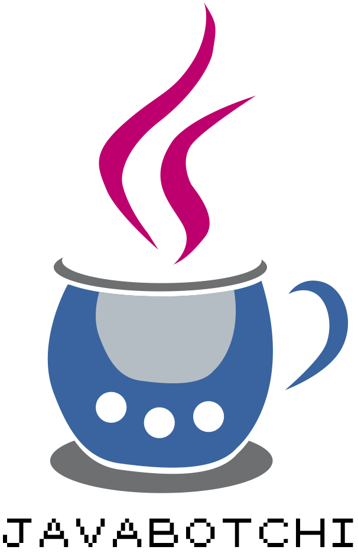

# WorkAdventure-Projekt - JavaBotichi

Dieses WorkAdventure-Projekt basiert auf dem [WorkAdventure Starter-Kit]([https://workadventu.re](https://github.com/workadventure/map-starter-kit)).

## Anleitung

Öffne folgenden Link um das Spiel nach vorgesehenem Ablauf zu Starten:

https://play.workadventu.re/_/global/debkou.github.io/myJavaBotchi/hauptraum.tmj

Um andere Karten zu öffnen, ändere den Kartennamen in der URL ab.
Beispiel:
Du möchtest Dir Level Eins ansehen:
-	Ersetze „hauptraum.tmj“ durch „levelEins.tmj“

## Die Spielwelt

Der Storymodus spielt an der Fachhochschule Südwestfalen in Hagen. Hauptcharakter ist ein Studierender der Wirtschaftsinformatik des Fachbereichs TBW, der in Form eines Avatars vom Spieler gewählt und modifiziert werden kann.
Der Hauptcharakter (im Folgenden auch Botchi genannt) nimmt am Abend an einer Studentenparty des Fachbereichs TBW teil und erwacht am folgenden Morgen an einem ihm unbekannten Ort.
Botchi weiß nicht mehr, wie er dorthin gelangt ist oder wie der gestrige Abend endete. Was er weiß, ist, dass er an diesem Ort gefangen ist. Botchi möchte herausfinden, was passiert ist und vor allem, wie er diesen Ort wieder verlassen kann.
Im Verlauf des Spiels lüftet Botchi spannende Geheimnisse über seine Hochschule und macht eine Entdeckung, die ihm und seinen Kommilitonen im Studium noch hilfreich sein wird.
Der Spieler muss Botchi mit seinen Java-Kenntnissen helfen, die Programmierrätsel zu lösen und ihn somit aus seiner misslichen Lage zu befreien.

Willst du mit deinem Wissen Botchi auf seinem Abenteuer begleiten?

## Licenses

This project contains multiple licenses as follows:

* [Code license](./LICENSE.code) *(all files except those for other licenses)*
* [Map license](./LICENSE.map) *(`office.tmj` and the map visual as well)*
* [Assets license](./LICENSE.assets) *(the files inside the `src/assets/` folder)*
